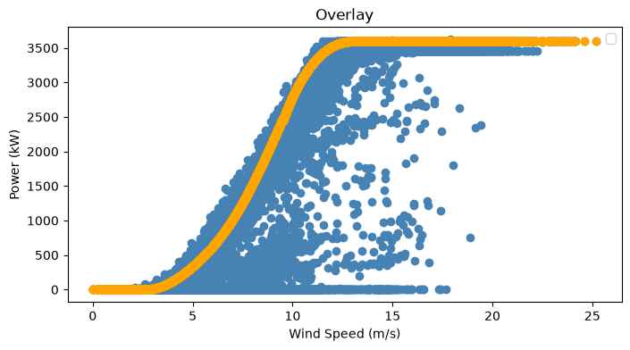
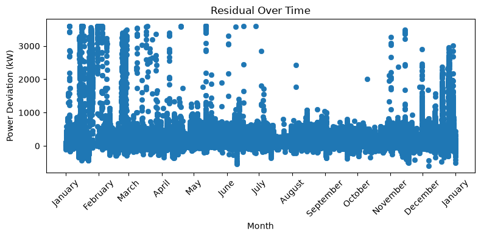

# Wind Turbine anomaly detection — Project Report

## Overview

This project uses the [Kaggle Wind Turbine SCADA Dataset](https://www.kaggle.com/datasets/berkerisen/wind-turbine-scada-dataset)
to detect anomalous turbine behavior. The dataset contains no failure labels problem: identify when actual power output deviates from what the turbine should be producing, given
current wind conditions, and investigate what drives those deviations.

---

## Exploratory Data Analysis

After initial EDA, two graphs shaped the direction of the entire project.

### Graph 1 — Wind Speed vs Power Overlay

Plotting actual power against wind speed, with the manufacturer's theoretical
power curve overlaid, shows the expected S-curve relationship: power is ~0 below
cut-in speed (~3-4 m/s), rises steeply through the mid-range, and plateaus near
rated capacity (~3,600 kW) above ~12 m/s.

The blue cloud of actual readings mostly hugs the theoretical curve, but a
significant number of points fall **below** it — some only slightly, some all
the way down to near-zero power despite strong wind. Very few points exceed the
curve. This told us underperformance, not overperformance, is the dominant and
relevant type of deviation to investigate.

### Graph 2 — Residual Over Time

Plotting the residual (`Theoretical Power − Actual Power`) across the full year
revealed that deviations are **not randomly scattered** — they cluster densely
in certain months (notably winter and parts of spring/late autumn) and are
comparatively calm through summer. This seasonal clustering indicated the
anomalies carry real structure, rather than being pure sensor noise.

---

## Two Paths Forward

These two graphs paved the way for two complementary directions:

### Path 1 — Data Analysis: *What is driving the anomalies?*

Using the residual clustering as a starting point, this path investigates
**why** deviations happen when they do — cross-referencing flagged anomalies
against time of day, month/season, and wind direction, to distinguish
between plausible causes (e.g. icing in cold months, scheduled curtailment,
yaw misalignment) rather than treating every deviation as an unexplained fault.

### Path 2 — Machine Learning: *Can we predict expected power directly from data, and flag deviations automatically?*

Using the overlay graph as a starting point, this path builds a data-driven
replacement for the theoretical power curve:

1. Anomalous points were identified using a wind-speed-binned median threshold
   (robust to outliers) and removed from the training set.
2. Several regression models were trained on the cleaned data (wind speed +
   wind direction → actual power), including Linear Regression, Polynomial
   Regression, Decision Tree, Random Forest, Gradient Boosting, and KNN.
3. **Decision Tree Regressor** performed best and was selected as the final
   model.
4. The trained model was wrapped in a `TurbineMonitor` class that predicts
   expected power for given conditions, compares it against actual output,
   and raises an alert when the deficit exceeds a threshold calibrated to the
   model's typical error (MAE).
5. The monitor was run across the full dataset as a simulation of real-time
   deployment, producing a log of flagged anomaly periods for engineers to
   review.

---

## Status / Next Steps

- [x] EDA and power curve overlay
- [x] Residual analysis over time
- [x] Anomaly-filtered training data
- [x] Model comparison and selection
- [x] `TurbineMonitor` class for live-style alerting
- [ ] Cross-tabulation of anomalies against time-of-day / season / wind
      direction (Path 1, in progress)
- [ ] Duration-aware alerting (only flag sustained deviations, not single
      noisy readings)
